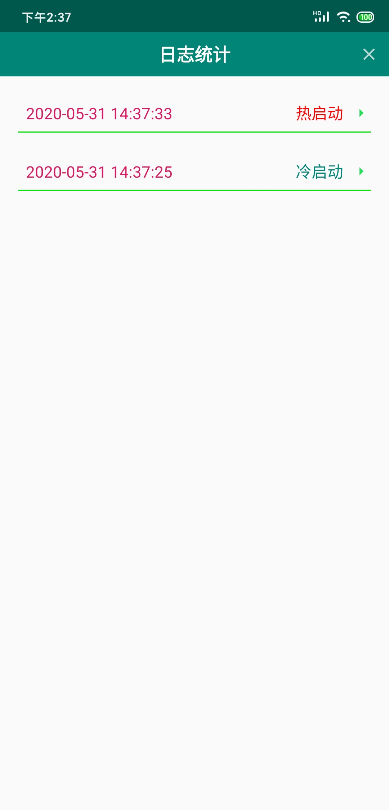
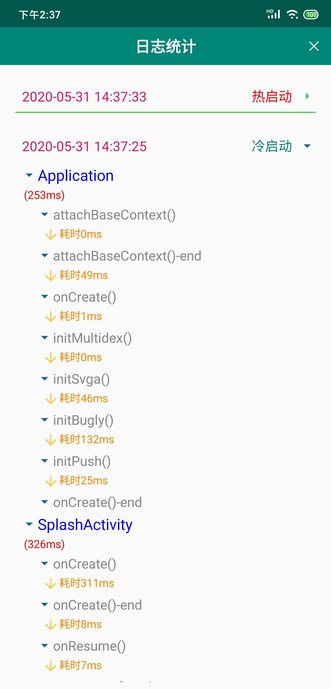
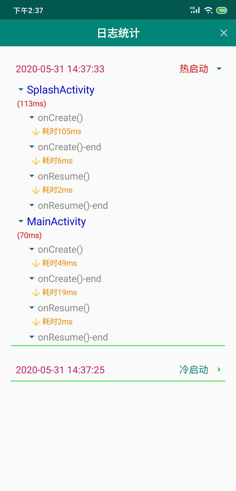

## 应用启动时间记录工具

#### 简介：
- 精确记录程序运行时间，包括生命周期，三方sdk初始化等，方便分析应用启动速度

#### 使用：
1. 引入依赖

2. 精确埋点
```

// 例如：记录application中各个sdk初始化时间
class MyApplication:Application{
    
    override fun onCreate() {
        super.onCreate()
        TraceTimeMonitor.trace(ChainField.CHAIN_APPLICATION, TagField.ONCREATE,true)       //记录
        // SDK 初始化
        initSDK1()
        TraceTimeMonitor.trace(ChainField.CHAIN_APPLICATION, TagField.INIT_SDK1)           //记录
        initSDK2()
        TraceTimeMonitor.trace(ChainField.CHAIN_APPLICATION, TagField.INIT_SDK2)           //记录
        ....
        TraceTimeMonitor.trace(ChainField.CHAIN_APPLICATION, TagField.ONCREATE_OVER)       //记录       
    }
}

//自定义报告策略（可选，默认存入数据库）
TraceTimeMonitor.addReportStategy(object:ReportStrategy{
      override fun report(context: Context, traceEntity: TimeTraceEntity) {
           Logger.i(TAG,"上传到服务器${traceEntity.toString()}")   
      }
})
//报告
TraceTimeMonitor.report(this) //在记录之后的任何时刻可以上报
```
 - 链（TraceChain）的概念：
    - 一条链由很多连续的记录组成，每个记录就是一个标签。 比如有一条链的名称是MainActivity，那它的一连串记录可以是 onCreate(),onCreate()-end,onResume(),onResume()-end；
    注意每条链必须有一个起始记录，每条链的记录都是从起始记录开始的，当遇到起始记录时，则这两条链重新开始记录
 - 标签（TraceTag）的概念：
    - 一个标签就是一条记录，记录了此刻的标签名字和时间戳
3. 查看数据分析
    - 启动 RecordLogsActivity 即可查看

    - 你能看到，已经自动帮你记录了应用的启动时间
        
    
    